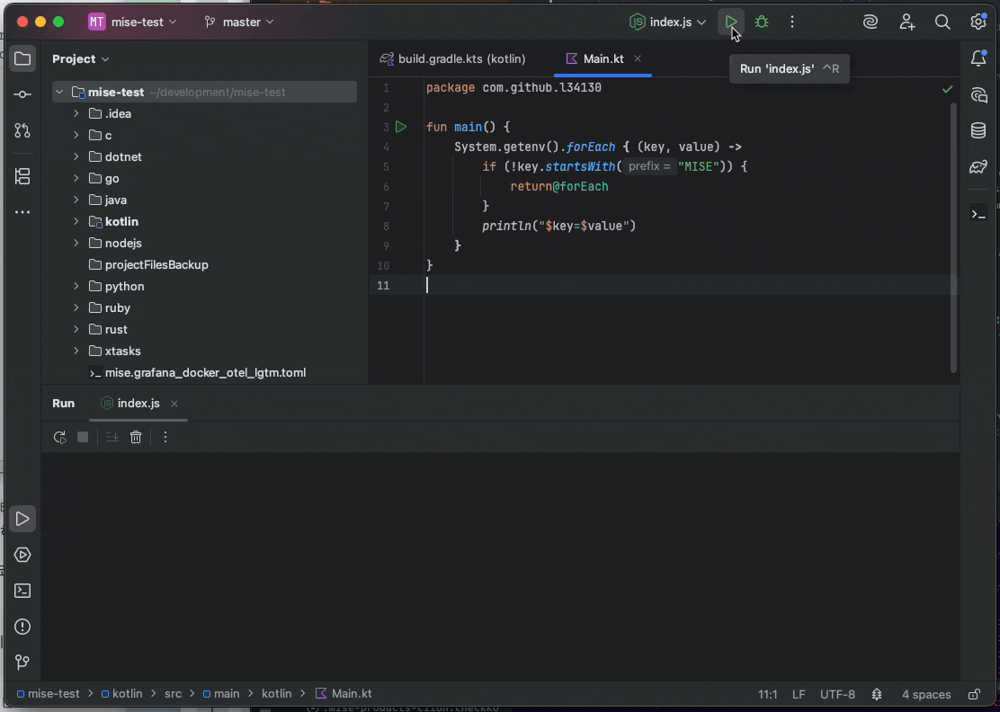

<!-- Plugin description -->
# Mise

**[GitHub](https://github.com/134130/intellij-mise)** | **[Issue](https://github.com/134130/intellij-mise/issues)** | **[Changelog](https://github.com/134130/intellij-mise/blob/main/CHANGELOG.md)**

**Mise** is a plugin for JetBrains IDEs that provides integration with [mise-en-place](https://mise.jdx.dev)

## Features

- **Environment Variables**: Set environment variables for your run configurations from `mise.toml` files.
  - See [Supported Run configurations](#supported-run-configurations) for the list of supported Run configurations.
- **Tool Integration**: Set project's SDK automatically from `mise.toml` files.
  - `java`, `go`, `node`, `deno` and `ruby` SDKs are supported.
- **Language Support**: Provides language features for `mise.toml` files.
  - Code completion
  - Reference (refactoring)
  - Language Injection
- **Diagram Support**: Provides task dependency diagrams.

## Supported Run configurations
- **JVM**
  - Java
  - Kotlin
  - JUnit
  - Gradle
- **Go**
  - Go Build
  - Go Test
- **Python**
- **Node.js**
  - Node.js
  - npm
  - Deno
- **C / C++** (only support for application level settings)
  - C/C++ File
  - CMake Application
  - Makefile target
- **C#**
- **Ruby**
- _Submit issue if you need others_

<!-- Plugin description end -->

## Screenshots

## Installation

- Using the IDE built-in plugin system:
  
  <kbd>Settings/Preferences</kbd> > <kbd>Plugins</kbd> > <kbd>Marketplace</kbd> > <kbd>Search for "Mise"</kbd> >
  <kbd>Install</kbd>
  
- Manually:

  Download the [latest release](https://github.com/134130/intellij-mise/releases/latest) and install it manually using
  <kbd>Settings/Preferences</kbd> > <kbd>Plugins</kbd> > <kbd>⚙️</kbd> > <kbd>Install plugin from disk...</kbd>

## Acknowledgements

- [mirrord-intellij](https://github.com/metalbear-co/mirrord-intellij)
- [EnvFile](https://github.com/ashald/EnvFile)
- [ProjectEnv](https://github.com/BredoGen/ProjectEnv)
- [intellij-direnv](https://github.com/fehnomenal/intellij-direnv)
- [intellij-better-direnv](https://github.com/Fapiko/intellij-better-direnv)
- [project-env-intellij-plugin](https://github.com/Project-Env/project-env-intellij-plugin)
- [hermit-ij-plugin](https://github.com/cashapp/hermit-ij-plugin)
- [github-workflow-plugin](https://github.com/YunaBraska/github-workflow-plugin)
- [avro-schema-support](https://github.com/opwvhk/avro-schema-support)
- [aws-toolkit-jetbrains](https://github.com/aws/aws-toolkit-jetbrains)

## Ecosystem

- See [mise-vscode](https://github.com/hverlin/mise-vscode/) if you are looking for a similar plugin for VSCode
- [Mise documentation](https://mise.jdx.dev/)

---
Plugin based on the [IntelliJ Platform Plugin Template][template].

[template]: https://github.com/JetBrains/intellij-platform-plugin-template
[docs:plugin-description]: https://plugins.jetbrains.com/docs/intellij/plugin-user-experience.html#plugin-description-and-presentation
